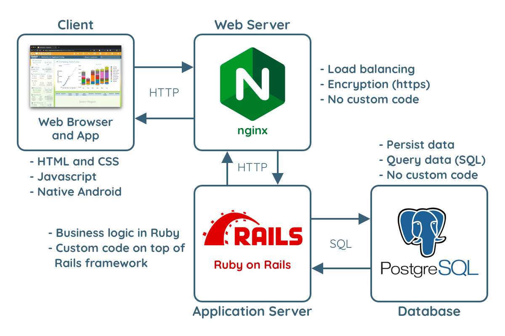

The complete Clypboard application can be divided into four distinct parts:

## Client
Users access Clypboard through a client - either a web browser or the Android application. The web browser uses HTML and CSS to display and format the content. Custom Javascript code executes in the browser to allow the user to dynamically interact with the page (e.g. plots, form validation, maps, most of the technician UI).

## Web Server
We use the industry standard [nginx web server](https://www.nginx.com/) to handle all information passed to and from the clients. The clients send HTTP requests to the web server, which forwards the requests on to an instance of our application server. Although there's no custom code being executed here, it's a vital part of the Clypboard architecture. nginx is designed to handle large volumes of traffic and pass each request onto one of the many application server instances that are running (at any given time, there are usually 24-36 application servers running at once to handle all of our traffic).

## Application Server
The application server is where most of the custom code and business logic is executed. It's written in the [Ruby programming language](https://www.ruby-lang.org/en/) using the popular [Ruby on Rails web framework](https://rubyonrails.org/). Essentially, the application server takes an incoming HTTP request, performs some business logic, probably queries the database, and composes a response to send back to the client. Since the application server is written in Ruby, our scripts are written in Ruby as well. 

## Database
We use [PostgreSQL](https://www.postgresql.org/) to persist and query all of our data. PostgreSQL is a popular relational database management system - meaning it uses SQL as its interface language. Like the web server, there's not custom code being executed at this level. However, the database is the cornerstone of the Clypboard architecture since it allows us to safely store millions of records of data and query them in real time. One of the main purposes of the application server is to convert our Ruby code into SQL queries that the database can understand and use. 